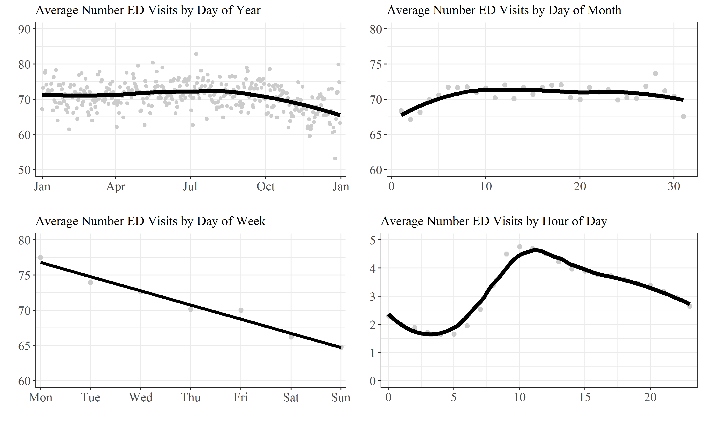

# Opioid Prescribing in EMRs

  

# About

This repository was written in 2019. It uses electronic medical record (EMR) data from an emergency department (ED) in a large U.S hospital to determine how cultural stereotypes and institutional constraints influence patterns of pain treatment. Specifically, it examines how pain treatment via opioid analgesices is influenced by the intersection of ED crowding and race, the time patients visit the ED, patients’ medical histories, patients’ diagnoses, age, sex, marital status, and year of analysis. Results generally support past findings on these topics, but does so with larger data. Most interestingly, the results show a negative relationship between ED crowding and opioid prescribing.

# Usage
This repository was built only for personal use, so it requires a few steps for migrating to a new computer:
- Attain access to electronic medical records. This may be a difficult task, given that most ERM data is restricted, and given that hospitals may have different systems for recording medical data.
- Install all required libraries used in the repository.

Afterwards, users are advised to run all scripts within the "Code" directory in the order of their numerical prefixes. Scripts without a numerical prefix should be run after scripts with numerical prefixes are run. 

# Details
Below is a brief overview of each script by meaning and folder.

    - **00 - Master.R**
        - Run all key steps for wrangling the data.
    - **01 - Identify key providers.R**
        - Create a vector that lists all providers in the hospital.
    - **02 - Determine which prescriptions are opiates.R**
        - Match prescription generic names to a list of opioid generics to identify whether a given prescription was an opioid.
    - **03 - Prep encounter data.R**
        - Clean the encounter dataset so that each column corresponds to a single variable. 
        - Rename and create a few convenience variables.
    - **04 - Prep provider data.R**
        - Create a dataset about providers.
        - Track how many opioids each provider prescribed
    - **05 - Prep clinic data.R**
        - Create a clinic-level dataset.
        - Attempt to identify unique clinic names.
        - Pull descriptive statistics about each clinic based on information in the encounter dataset.
    - **06 - Create analysis dataset.R**
        - Merge the clinic, provider, and prescription datasets.
        - Remove unecessary varaibles.
        - Identify whether visits were in the emergency department.
        - Format and merge patient information into encounter info.
        - Estimate degree of hospital crowding
    - **07 - Finalize analysis dataset.R**
        - Keep only one hospital emergency department
        - Break categorical variables into dummies.
        - Remove useless variables.
        - Transform variables (e.g. cap outliers, create dummies, etc.)
    - **08 - Create diagnosis dataset.R**
        - Create a dataset containing every diagnosis during a given ER visit.
    - **09 - Figure 1 - ER crowding by unit of time.R**
        - Generate a figure showing the degree of ER crowding by unit of time.
    - **10 - Table 1 - Descriptive Stats.R**
        - Generate basic descriptive stats of all variables in the model.
    - **11 - Table 2 - Models 11-19-19.R**
        - Create three different analysis datasets (of increasing size) for three corresponding models.
        - Create formulas for each model.
        - Run each model.
        - Format model results.
        - Efficiently estimate marginal effects